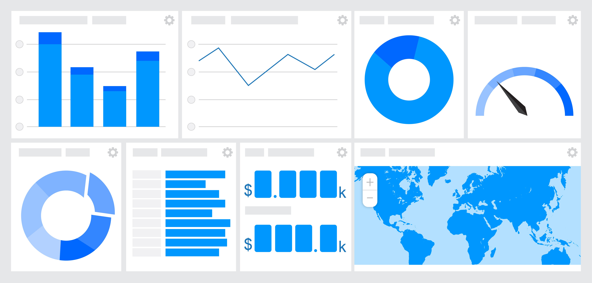
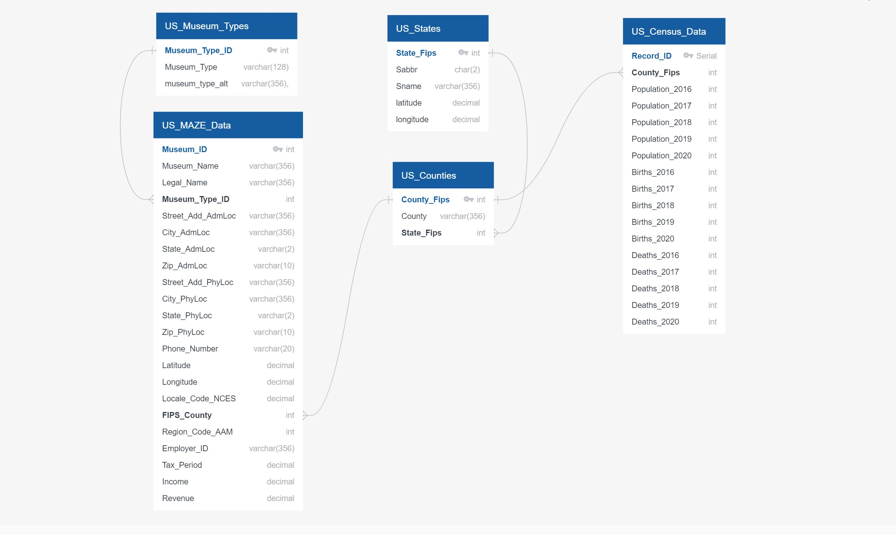
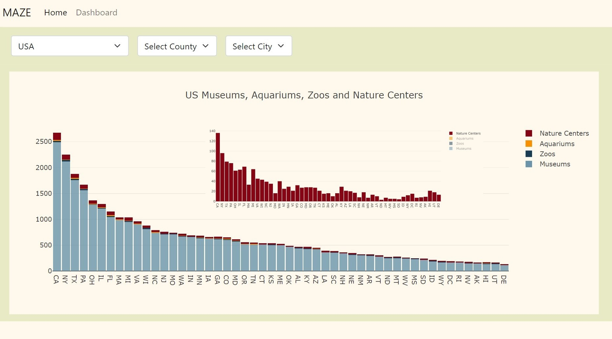
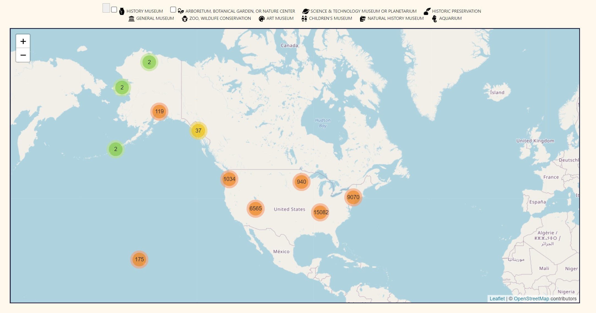
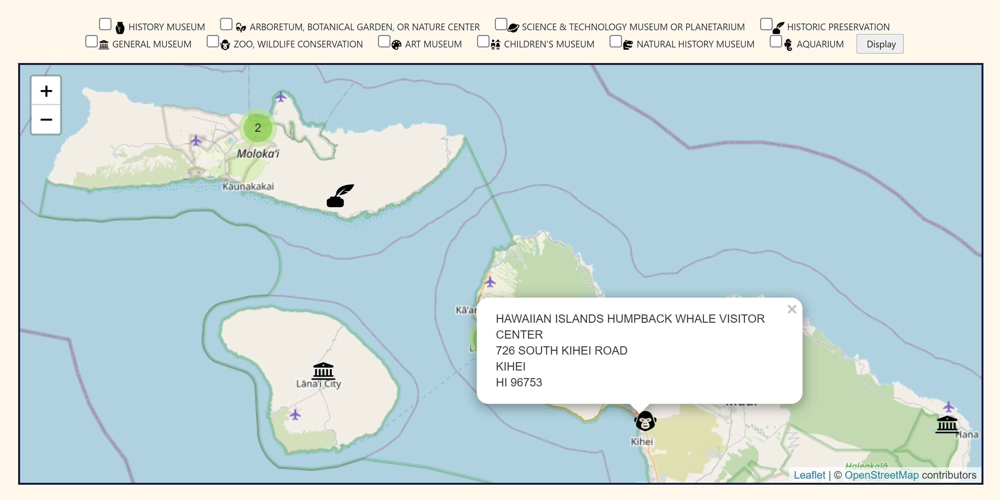
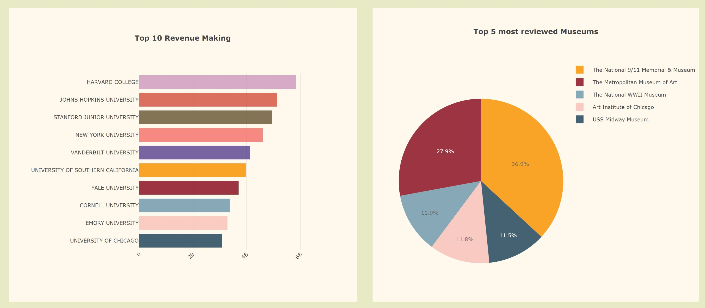
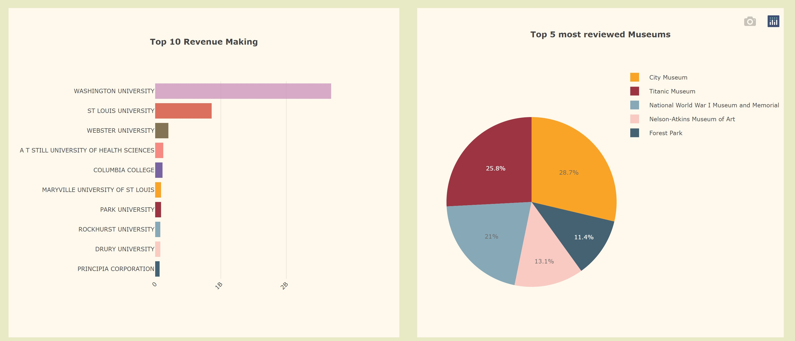
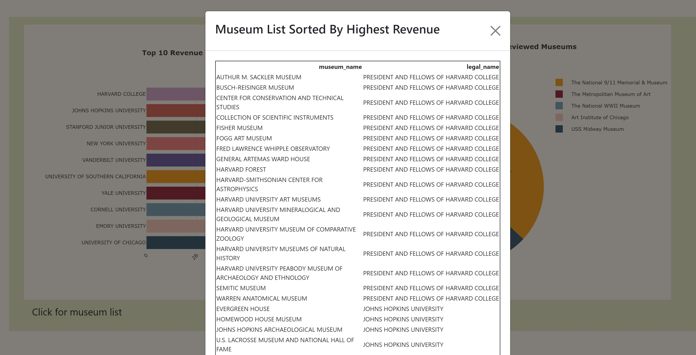
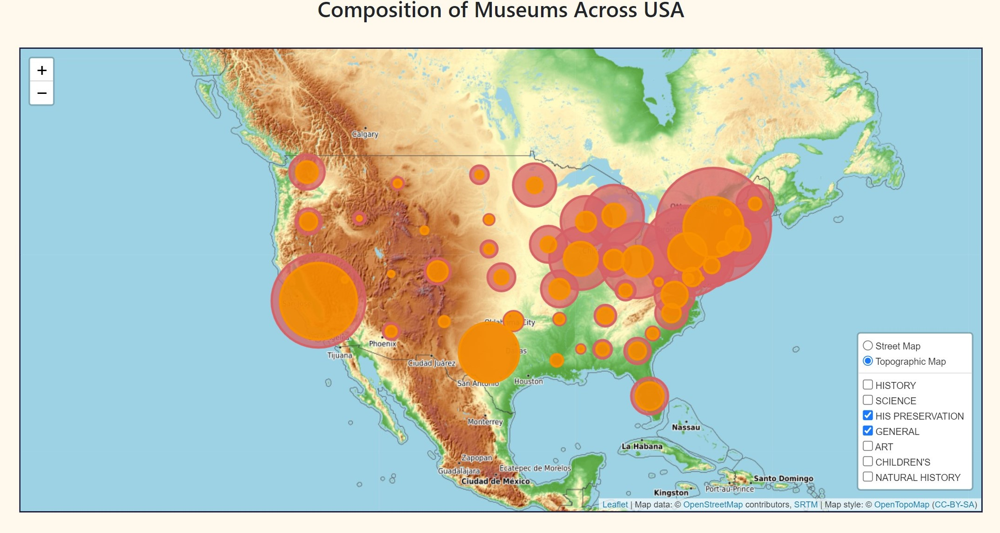

<h4>Project-MAZE</h4><h6>Museums - Aquariums - Zoos - Exploration</h6>

____________________________________________________

## An interactive dashboard

_____________________________________________________

<table><tr><td align="center"></tr></td></table>

### Contributors: 
**Vasantha Mutyala (V-MalM) / Valense Acquah-Louis (Tema-2021) / Saiyid Kazmi (saiyidmkazmi)  / Debra Potts (dschoen24)**

### Objectives
**The objective of this project was to create an interactive dashboard to help users**
* Plan trips after the pandemic is over
* Help with career choices if interested in museums, preservation etc.
* Help users with children plan vacations

**Technologies Used:**
* PostgreSQL
* Python, Flask, Jinga
* HTML/CSS
* Bootstrap
* JavaScript
* JQuery

**Project Description:**

There are many attractions around the world, some attractions are for their intrinsic, exhibited natural or cultural value, others for their historic significance and yet still some others for their natural or built beauty. All these attributes offer leisure and amusement for visitors. 

For this project were going to explore museums, aquariums, zoos, and nature centers within the US.

**This dashboard would have answered these questions and more**
* Which city or state or county has the most museums? 
* How many zoos or aquariums are there in various regions? 
* What are the most popular museums?
* What museums or related organizations have highest revenue?
* How does the composition of museum types differ across the country?
* Combine it with Census Data for population related analysis (most museums/zoos/aquariums per     population)

**Data Sources:**
*	Museums, Aquariums, and Zoos
https://www.kaggle.com/imls/museum-directory?select=museums.csv
*	Census Data 
https://www2.census.gov/programs-surveys/popest/datasets/2010-2020/counties/totals/

*	State FIPS: 
https://www.census.gov/library/reference/code-lists/ansi/ansi-codes-for-states.html

*	County FIPS:
https://www.nrcs.usda.gov/wps/portal/nrcs/detail/national/home/cid=nrcs143_01369

**More Resources:**
* https://www.kaggle.com/annecool37/museum-data

* https://www.kaggle.com/general/182617

**Cleaning and preparing data:**
* Source Data as CSV
    * All our data was derived from Kaggle, and Census data compiled by the US Govt. Moreover, we used previously formatted data that distinguishes Counties and States, Census Data.   
* Transform (Fill in the Gaps)
    * After identifying the fields that are required. We populated the N/A values with latitude and longitude that we retrieved using Google geocode API. We used reverse geocoding for some records to retrieve address based on their coordinates. 
* Transform FIPs
	* For records that had missing county FIPS_Code, we used a different strategy where we used the lat/lng to derive the county FIP values.
* Cleaned
    * The final records free of irrelevant information was obtained resulting in the loss of only 43 records and retaining 33030 records (using pandas). Final records were exported as a CSV and loaded into PostgreSQL for extraction of data. 

* ERD
* <table><tr><td align="center"></tr></td></table>

**Dashboard:**

A dashboard was created that shows 5 visualizations that were created using Plotly and Leaflet. First time, when dashboard loads, all visualizations on the page display all aquariums, zoos, nature centers and museums across the USA. The user can further narrow down their search to state, county, and city by using the selection list at the top of the page. In addition to that , there are certain features specific to each individual chart for making them more interactive.

* The first visualization is an interactive bar chart that displays aquariums, zoos, nature centers and museums for the USA, state, county or city depending on user selection. By using the legend located at the top right, the user can also change the display to specific categories.  
* <table><tr><td align="center"></tr></td></table>
    
* The leaflet displays all the attractions based on user selection. But it also provides an option to narrow down the search by selecting only the categories that they are interested in, by clicking the check boxes. This chart also displays name, the address and phone numbers to the various attractions.
* <table><tr><td align="center"></tr></td></table>
* <table><tr><td align="center"><td align="center"></tr></table>
 
* These charts are side by side on the dashboard, a horizontal bar chart and a pie chart. The analysis is of only the museums in the database. The horizontal bar chart shows the top 10 revenue making museums and the pie chart, the top 5 reviewed museums. Both charts are also dynamic/ interactive and change upon the selection of state, county, and city.  

* <table><tr><td align="center"></tr></td></table>
* <table><tr><td align="center"></tr></td></table>

* The museums are categorized by their legal names and to know the various museums that are affiliated to them the user can select the ‘click for museum list’ to the bottom left of the chart to display the list.

* <table><tr><td align="center"></tr></td></table>

* This chart is also an interactive map that shows information of the museums in the database. The chart has 2 different basemaps the user can select (street map or topographical view). The chart has a unique search option from the other charts as this search displays the types of museums and their ratios and how they are localized across the country. The user can select the museum type of choice by using the layer control located at the bottom right corner of the chart.

* <table><tr><td align="center"></tr></td></table>

**Deployment:**

The dashboard was deployed onto Heroku. This is a cloud platform that allows companies to build, deliver and scale apps. The deployment was performed via the following phases
* The database was prepared by creating a Schema
* The tables were imported in sequential order
* The required fields needed for the deployment on Heroku were created (requirements.txt, runtime.txt etc.)
* The connection string to the database in our app was changed
* And finally, the fields were pushed to GitHub and Deployed! 

**Presentation can be found in** [Presentation](/Presentation) 